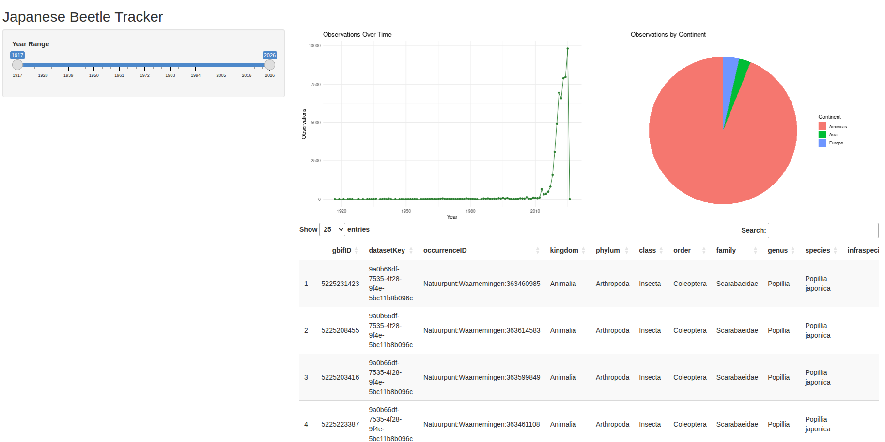

# Japanese Beetle Tracker (Shiny for R)

## About

Live app: [link to deployed app](https://019ceb54-87b7-f205-a239-f86b08a118bf.share.connect.posit.cloud/)

A simple Shiny for R dashboard for exploring Japanese beetle occurrence data.



## Requirements

Install the required R packages from the R console:

```r
install.packages(c("shiny", "DT", "ggplot2", "countrycode"))
```

## Running the App

From the R console:

```r
shiny::runApp("app.R")
```

Or from the terminal:

```bash
Rscript -e 'shiny::runApp("app.R")'
```
